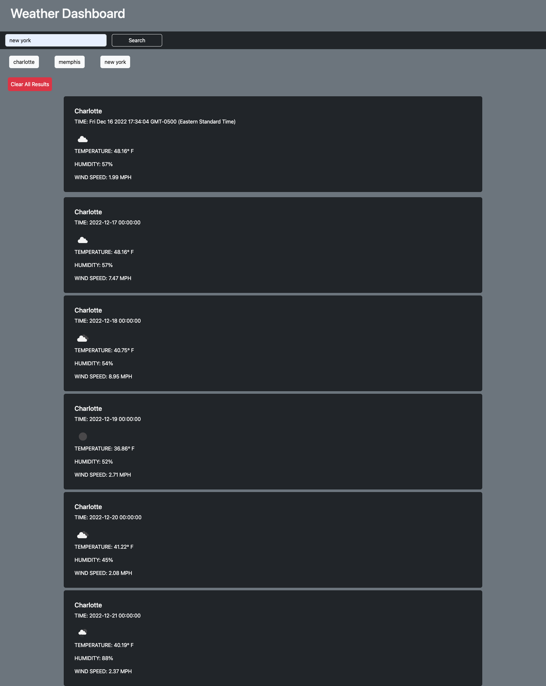

# Weather Dashboard Server Side API Challenge
[Link to my project](https://kassrojas.github.io/weatherDashboard-module06/)

## Table of Contents
- [Description](#description)
- [Visuals](#visuals)
- [Credits](#credits)

## Description

The Weather Dashboard allows the user to input a city name and get back the current weather conditions and a 5 day forecast. City name, date, time, temperature, humidity, wind speed, and an icon are rendered on the page from the API calls. Searches are saved locally and can be revisted to present the user with the weather conditions again. This application uses multiple API's provided by the Open Weather Map. The application is Javascript driven and bootstrap was used to style the webpage.

## Visuals
Screenshot of working webpage
 
 
 

## Credits

https://openweathermap.org/
